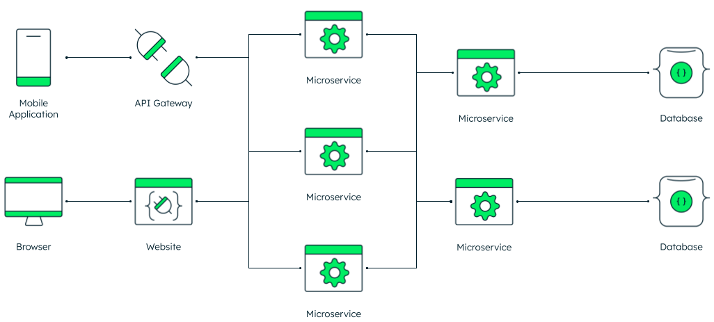

<link rel="stylesheet" href="https://cdnjs.cloudflare.com/ajax/libs/prism-themes/1.9.0/prism-a11y-dark.min.css" integrity="sha512-bd1K4DEquIavX49RSZHIE0Ye6RFOVlGLhtGow9KDbLYqOd/ufhshkP0GoJoVR1jqj7FmOffvVIKuq1tcXlN9ZA==" crossorigin="anonymous" referrerpolicy="no-referrer" />

# Flask - An Introduction

Flask is a lightweight Python server-side framework. It is known as a microframework becuase of it does not rely on external tools or programming languages in order to run. It is a WSGI (Web Server Gateway Interface) framework, an array of frameworks known to pass requests to web applications or frameworks. It is an intermediate step between front end and back end database structures.

A Flask application is a very minimal built-in server web service, involving custom routes. Server-side microservices are the core of how programmers interact with API's by retreiving routes and how API's can be created.



Combined with the ease of learning Python, Flask is a great starting point for programmers looking to build web services quickly from the ground-up.

```python
from flask import Flask

app = Flask(__name__)

@app.route("/")
def hello_world():
    return "<p>Hello, World!</p>"
```

The minimal Flask python file above is an example of user-defined routes.

1. The first line imports the flask class for Python.
2. Next, an instance of this flask class is created and stores it in the variable "app."
   **name** is a shorthand directive so Flask can locate Flask templates.
3. The route() function gives Flask a direction to use a route.
4. The function hello_world renders the message 'Hello World' to the browser when the '\' is retreived via a user GET request.

## Compiling and running Flask microservices

```python
pip install Flask
```

To run the Flask application,

```python
python -m flask run
```

This command will run on a local browser.
To run it on an externally visible port with public IP's, use

```python
flask run --host=0.0.0.0
```

To run with specific flags, the flags can be added to the run command. A useful flag for developing is

```python
python --app {app name} --debug run
```

## Further Reading

Flask documentation is very organized:
https://flask.palletsprojects.com/en/2.2.x/quickstart/

The next articles will delve on tutorials on how to implement useful functionality in Flask.
